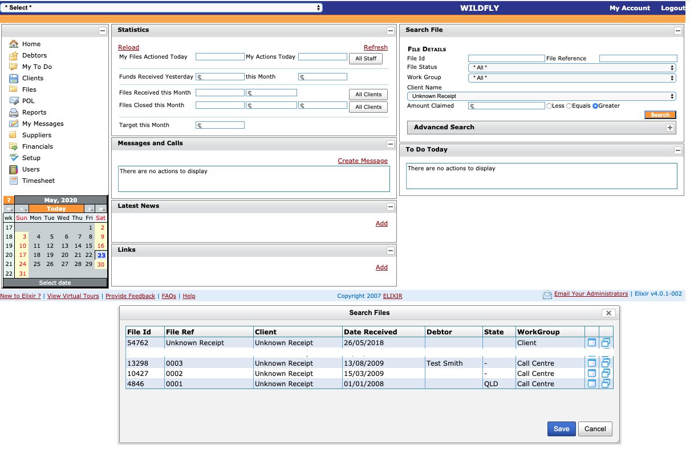
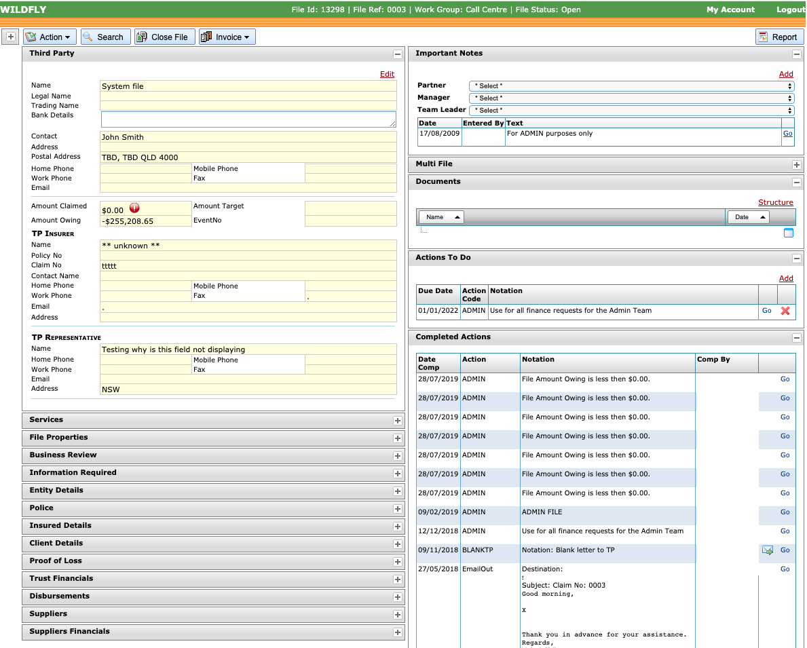

# Docker projects :: Totem Software Pty Ltd

## Elixir projects
*Elixir is a debt recovery system that is designed to help automate the debt recovery process. The Elixir system has been designed to assist specifically with insurance related debt recovery.*

*Also Elixir was used by Legal and Accounting professionals and potentially can be used in other areas.*

*This Elixir distribution is packaged as two docker containers: web application and mysql database (can be replaced with mysql server running separately, eg [AWS RDS](https://aws.amazon.com/rds/))*

* [totemsoft/wildfly-elixir](https://github.com/totemsoft/docker/tree/master/jboss)
* [totemsoft/mysql-elixir](https://github.com/totemsoft/docker/tree/master/mysql)

## Docker Compose
Set default values for environment variables using a `.env` file, which Compose automatically looks for.
Values set in the shell environment override those set in the `.env` file. See [docker-compose.yml](https://github.com/totemsoft/docker/blob/master/docker-compose.yml) file `services.*.env_file` section for default values:
* [jboss/env.list](https://github.com/totemsoft/docker/blob/master/jboss/env.list)
* [mysql/env.list](https://github.com/totemsoft/docker/blob/master/mysql/env.list)

Running this command will start the containers (`-d` in background) and leave them running:

    docker-compose up
    docker-compose up -d

Once you done, you can stop and cleanup your Docker Compose temporary files:

    docker-compose stop
    docker-compose rm -f
    docker-compose pull

Also here are some useful docker commands:

    docker-compose config
    docker ps -a
    docker images
    docker image prune
    docker image rm <image_id>

## Application source code

*Elixir* source code can be found in the [totemsoft/elixir](https://github.com/totemsoft/elixir.git) repository (private).

## Other Notes

    git remote set-url origin [updated link url https://........git]

## Main Screen

## File View

